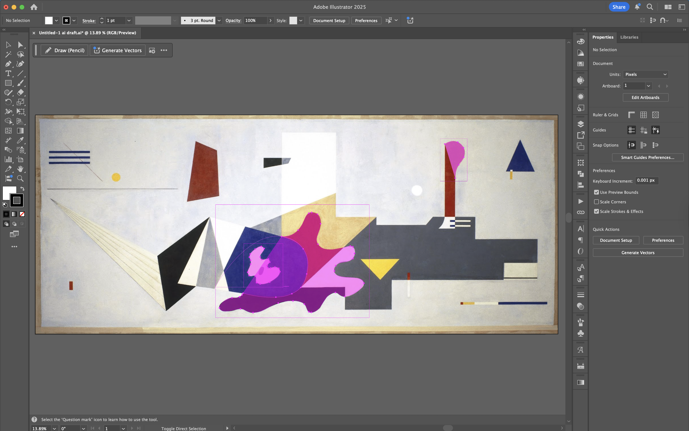
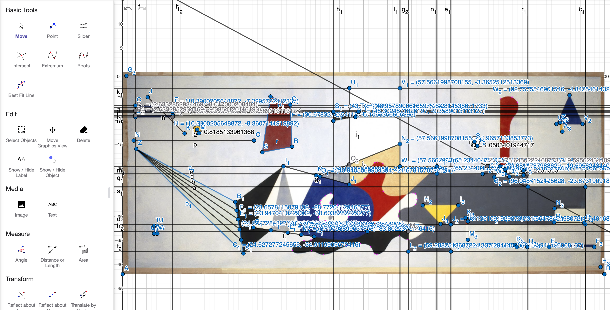
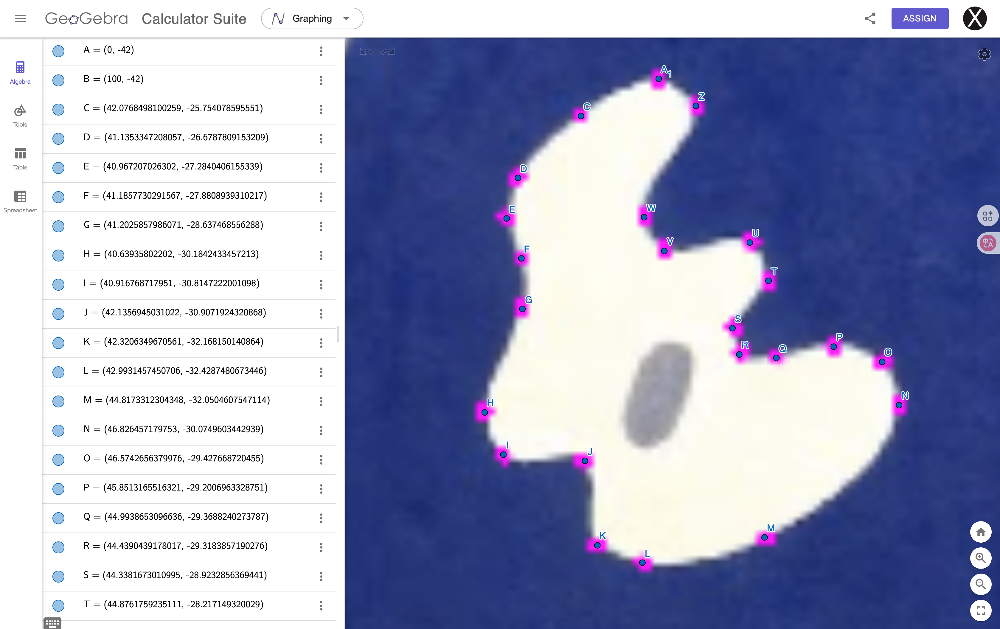
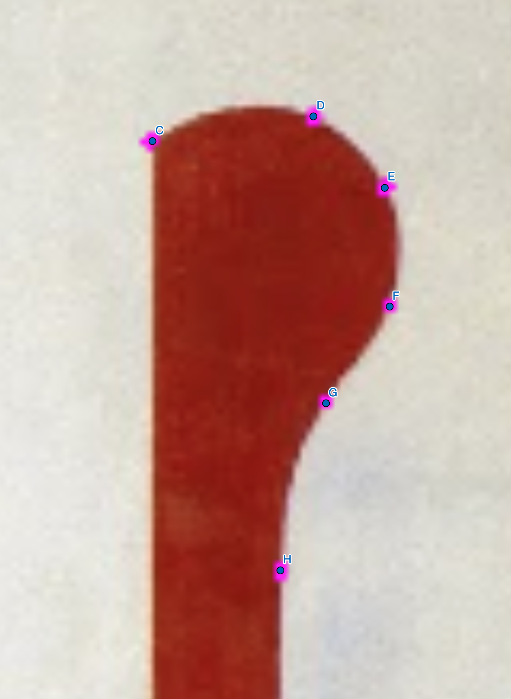
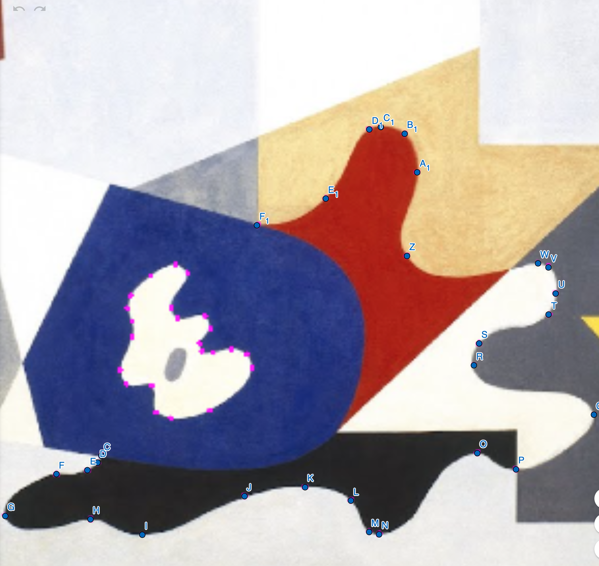

# Assignment 1: Geometric Abstraction

## 🎨 Source Artwork
For this assignment, I chose Ilya Bolotowsky’s [*Untitled, From the Williamsburg Housing Project Murals*](https://artsandculture.google.com/asset/untitled-from-the-williamsburg-housing-project-murals/-AEJMMIK6GTRlg?hl=en) (1936).   

---

## 🛠️ Process

For this project, I used both Adobe Illustrator and GeoGebra to plan the composition and identify the key coordinates. The painting contained a large, complex area of intersecting shapes, so entering full mathematical expressions for every single coordinate would have been intense. Since I had used variables and expressions for the coordinates in my Week 2 sketch.js, for this assignment, I experimented with the [`scale()`](https://p5js.org/reference/p5/scale/) function, which allowed me to map the entire composition on to a 1-to-100 scale with a unit of `(window)width` / 100. In this way, coords in the form of `A = (x, y)` is equvelant to `A = (x% width, y% width)`.

 
   

I used Illustrator’s Curve Pen tool to create the curves, then took a screenshot of the control points. I then imported the image into GeoGebra to plan the composition and identify the key coordinates, which helped me avoid intensive manual calculations. 

I used [`translate()`](https://p5js.org/examples/transformation-translate/) function [`rotate()`](https://p5js.org/reference/p5/rotate/) function to rotate an ellipse. (Source: [Stackoverflow.com](https://stackoverflow.com/questions/70073115/how-do-i-rotate-an-object-in-p5js).) I also played around with [`blendMode()`](https://p5js.org/reference/p5/blendMode/).

## ✅ Shape-drawing functions I used:
1. `rect()`
2. `circle()`
3. `triangle()`
4. `quad()`
5. `beginShape()` + `vertex()`/`curveVertex()` + `endShape()`
6. `arc()`