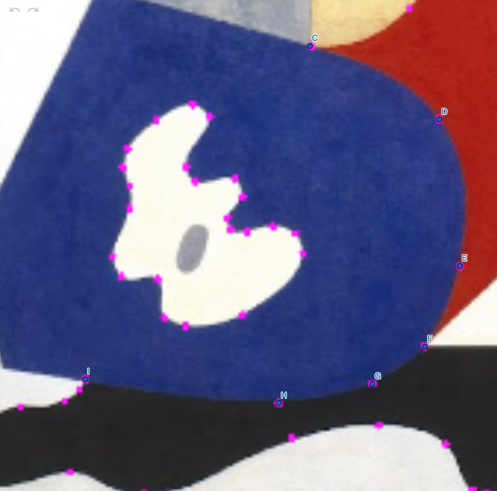

# Assignment 1: Geometric Abstraction

## 🎨 Source Artwork
For this assignment, I chose Ilya Bolotowsky’s [*Untitled, From the Williamsburg Housing Project Murals*](https://artsandculture.google.com/asset/untitled-from-the-williamsburg-housing-project-murals/-AEJMMIK6GTRlg?hl=en) (1936).   

---

## 🛠️ Process

For this project, I used both Adobe Illustrator and GeoGebra to plan the composition and identify the key coordinates. Since the painting contained a large, complex area of intersecting shapes, entering full mathematical expressions for every single coordinate would have been intense. Instead, I chose a mixed approach:
- For certain scattered objects, I used variables and expressions for the coordinates.
- For the more complex areas, I experimented with the [scale()](https://p5js.org/reference/p5/scale/) function, which allowed me to adjust the size of the entire composition more easily

 
   

I used Illustrator’s Curve Pen tool to create the curves, then took a screenshot of the control points. I then imported the image into GeoGebra to plan the composition and identify the key coordinates, which helped me avoid intensive manual calculations. I also played around with [blendMode()](https://p5js.org/reference/p5/blendMode/).

## ✅ Shape-drawing functions I used:
1. rect()
2. circle()
3. triangle()
4. quad()
5. beginShape() + vertex()/curveVertex() + endShape()
6. arc()