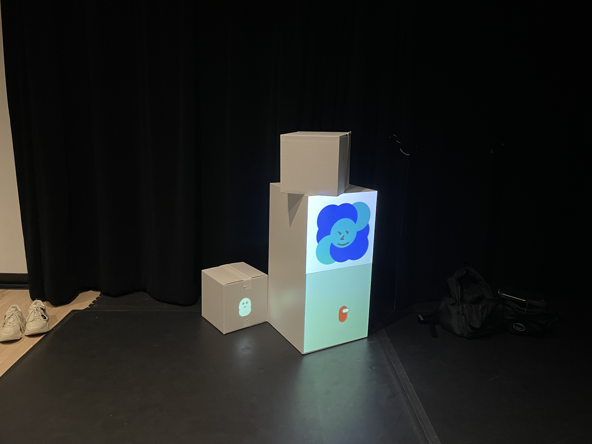
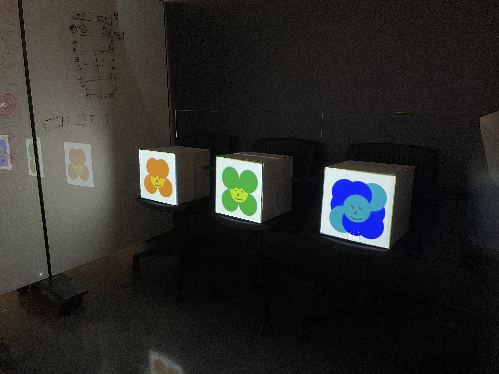
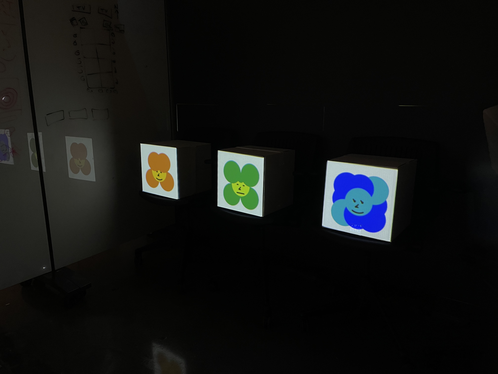
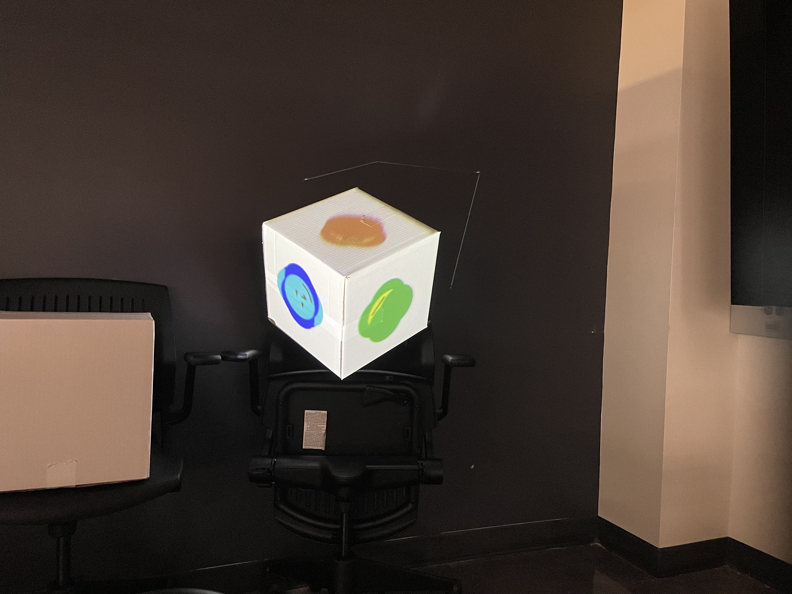
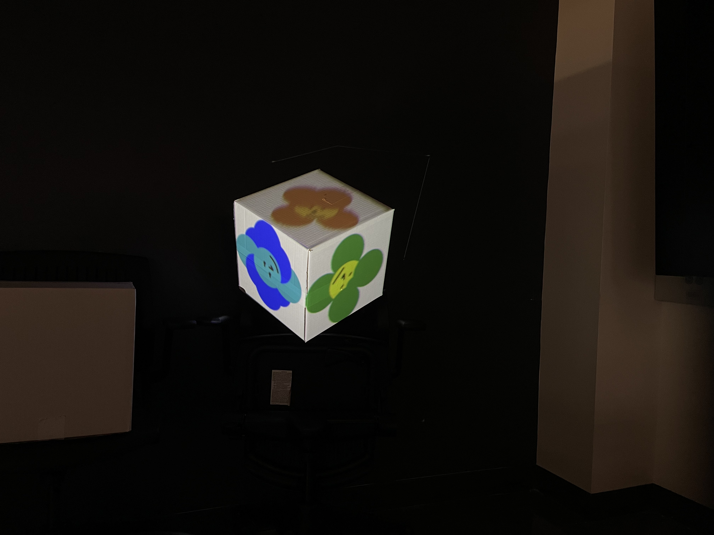

# Assignment 5: Projection Mapping Workshop

## Overview

For this assignment, I plan to bring back the robot graphics (from assignment 4) as they are mainly composed of simple shapes like circles,arcs, strokes, and points. I also want to reuse my approach with the time functions (from assignment 3) to synchronize three sketches that will share a same base code, with only minimal variations.

## Workshop Documentation

### October 29th in Class Workshop

Link to GitHub folder: [https://github.com/xl6294/CC2025-xl6294/tree/main/week9_p5MapperWorkshop](https://github.com/xl6294/CC2025-xl6294/tree/main/week9_p5MapperWorkshop)

### Office Hour on November 4th

#### Approach 1

 

Link to GitHub folder: [https://github.com/xl6294/CC2025-xl6294/tree/main/assignment5_p5MapperWorkshop1](https://github.com/xl6294/CC2025-xl6294/tree/main/assignment5_p5MapperWorkshop1)

#### Approach 2 (Mini-sketches are rotated by 45 degrees)

 

Link to GitHub folder: [https://github.com/xl6294/CC2025-xl6294/tree/main/assignment5_p5MapperWorkshop2](https://github.com/xl6294/CC2025-xl6294/tree/main/assignment5_p5MapperWorkshop2)

### Link to [Google Drive folder](https://drive.google.com/drive/folders/17CKxUg4lCBBjjW4S-M4NUxMtvHe7V-lO?usp=sharing) of all documentation photos and videos

## Process + Links to Drafts on p5.js Web Editor

1. In this draft, I figured out most of the functionality, except that the timing of animation. Right now, the pause of the robots after bloomed into full forms is too short, and there is a long gap after the exit of the first robot and before the entering of the next one.
   - [Assignment 5 I](https://editor.p5js.org/xl6294/sketches/wEVhF1bvH)
2. Here I figured out the correct timing, and I added in the expressions/faces of the robots.
   - [Assignment 5 II](https://editor.p5js.org/xl6294/sketches/L3TasaCiB)
