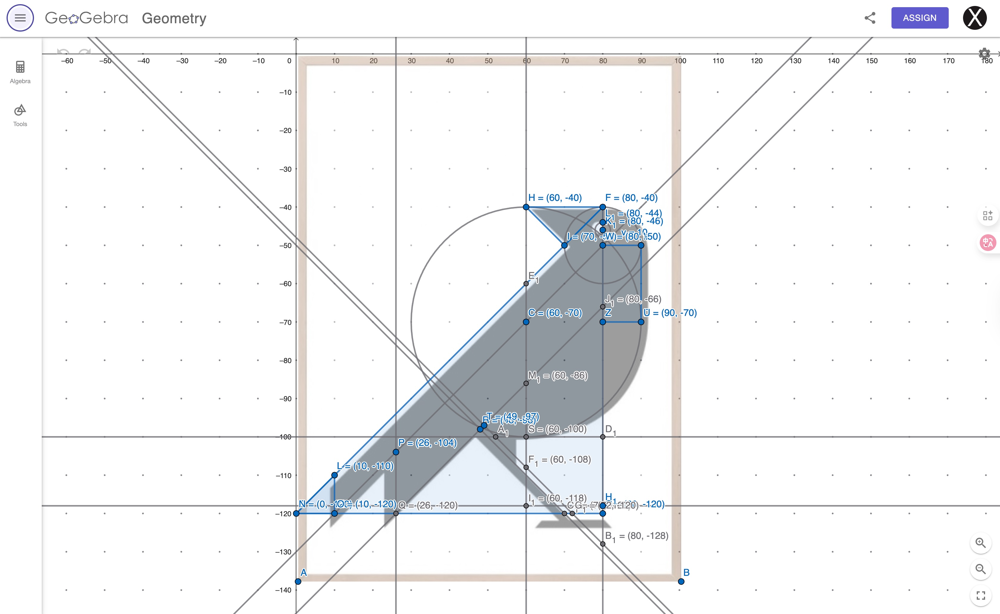

# Week 2

For this assignment, I worked on recreating the form of a geometric crow based on a [**reference image**](https://scandiposter.pl/en/with-birds/geometric-poster-crow.html). I used [**GeoGebra**](https://www.geogebra.org/m/s7mhgeta) to plan the composition and identify the key coordinates, which helped me avoid intensive manual calculations.

 
*Left: reference image from [**Scandi Poster**](https://scandiposter.pl/en/with-birds/geometric-poster-crow.html).*  
*Right: draft planning on [**GeoGebra Geometry**](https://www.geogebra.org/m/s7mhgeta).*

I also experimented with using expressions and variables from fractions of the `windowWidth` to make the shapes scalable and movable. However, the results were often too large for a landscape canvas, so I switched to using `windowHeight` as the reference instead, which made the scaling more manageable.

## Shape-drawing functions I used:
- triangle()
- beginShape() / endShape()
- circle()
- arc()
- rect()

[~~p5.js Web Editor Link~~](https://editor.p5js.org/xl6294/sketches/-VZWWZEct)
